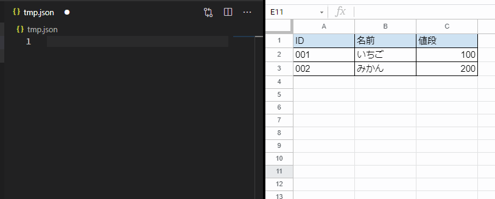

# TSV Paste JSON

クリップボードのTSVテキストをJSONに変換してエディタにペーストします。



# Create VSIX

```
npm i
vsce package
```

# Install from VSIX

- VSCodeのコマンドパレット(F1)
- Extensions: Install from VSIX... を選択
- .vsix ファイルを選択
